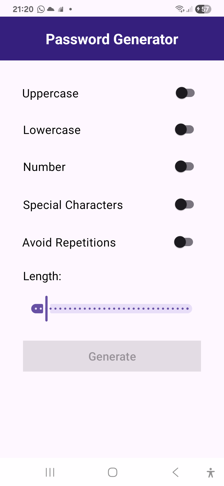
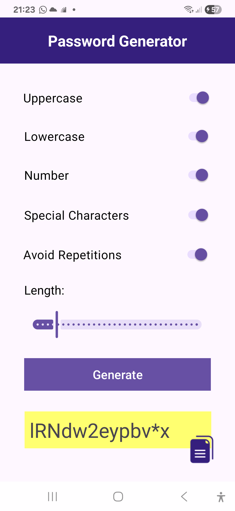
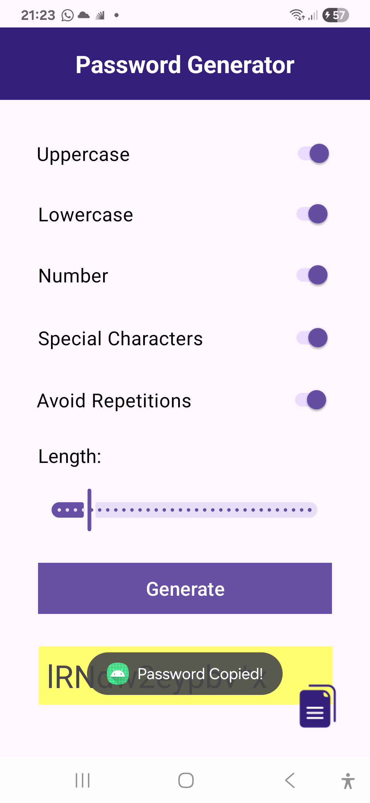

<h1 align="center">Password Generator App 🔒 </h1>

## Project 

This Android applicatipn was developed as a password generator which offers different possibilities for password creation, allowing the user to choose what will compose the string, including numbers and uppercase, lowercase and special characters. 

## Layout 

  <table style="border-collapse: collapse; margin: 10px;">
    <tr>
      <td style="padding: 10px; text-align: center;">
        
      </td>
      <td style="padding: 10px; text-align: center;">
        
      </td>
      <td style="padding: 10px; text-align: center;">
        
      </td>
    </tr>
  </table>

## Technologies Used 

- **Programming Language:** Kotlin
- **Development Environment:** Android Studio
